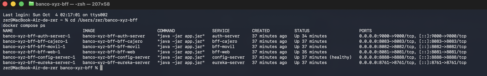
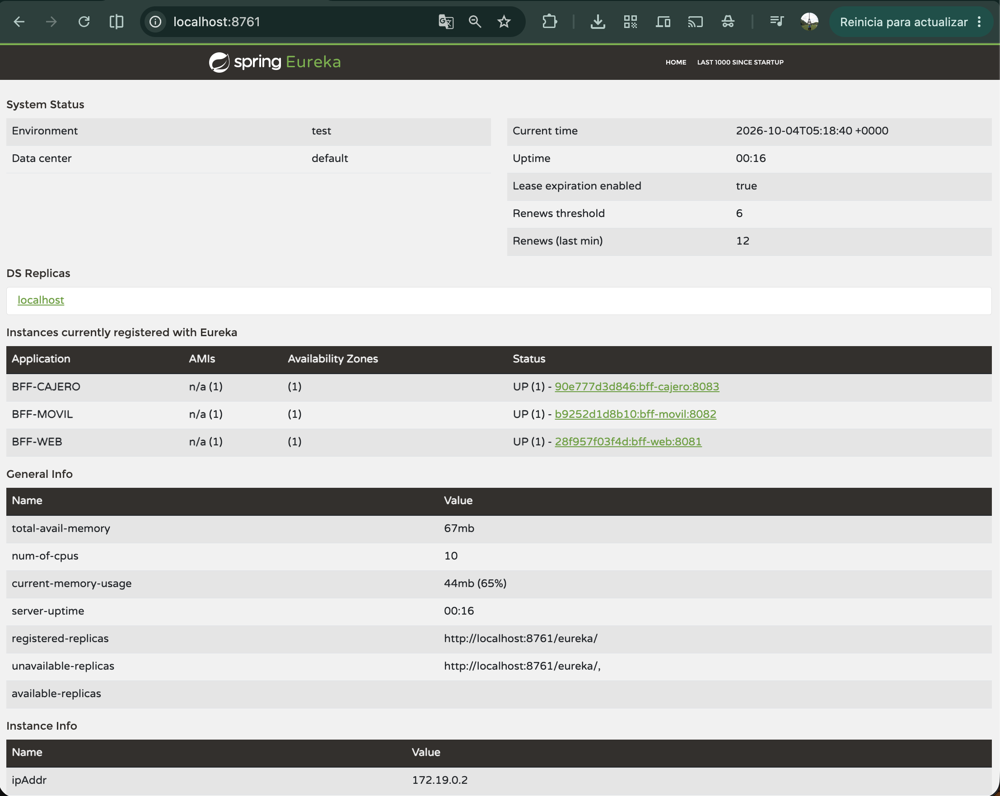
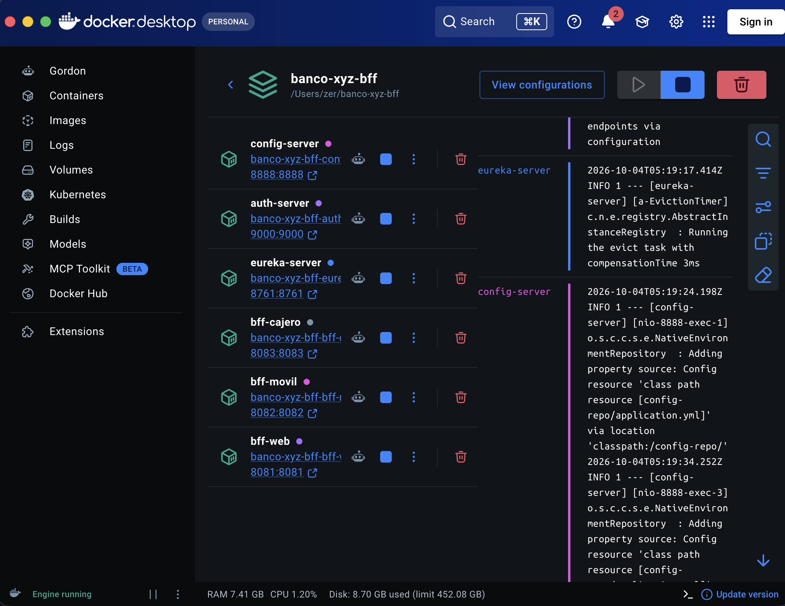

# Banco XYZ - Microservicios seguros y resilientes en la nube (Exp3 S8)

Este proyecto es la continuación directa del que vengo armando desde Exp2:
en S6 separé el BFF en microservicios con Spring Cloud (Config Server,
Eureka y Circuit Breaker con Resilience4j) y en S7 sumé una saga de
transferencias con mensajería JMS. Esta semana lo dejé listo para correr en
un entorno cloud:

- **OAuth2.0:** un servidor de autorización propio (`auth-server`) emite los
  tokens y los tres BFF los validan como resource servers. Reemplaza al JWT
  propio de S5.
- **Docker:** cada microservicio tiene su `Dockerfile` (multi-stage).
- **docker-compose:** un solo `docker-compose.yaml` levanta los 6
  microservicios en orden.

El detalle del diseño, las decisiones y los problemas que encontré está en
`PROPUESTA_TECNICA_S8.md`.


## Módulos

| Módulo          | Puerto | Rol                                                                    |
|-----------------|--------|------------------------------------------------------------------------|
| `eureka-server` | 8761   | Service Discovery. No depende de nadie más.                            |
| `config-server` | 8888   | Configuración centralizada (backend `native`, carpeta `config-repo/`). |
| `auth-server`   | 9000   | Servidor de autorización OAuth2: emite los access tokens (JWT).        |
| `bff-web`       | 8081   | Dueño de los datos (CSV en memoria). Además aloja la saga JMS (S7).    |
| `bff-movil`     | 8082   | Pide todo a `bff-web` vía Eureka, con Circuit Breaker.                 |
| `bff-cajero`    | 8083   | Saldo y retiro, también vía `bff-web` con Circuit Breaker.             |

```
   cliente ──(1) token──► auth-server :9000
      │
      └─(2) Bearer token──► bff-web :8081 / bff-movil :8082 / bff-cajero :8083
                                   │  (validan la firma con el JWKS del auth-server)
                                   │
              movil y cajero ──(3) mismo token──► bff-web /interno/**  (vía Eureka + Circuit Breaker)

   eureka-server :8761  (registro de servicios)      config-server :8888  (configuración común)
```

El broker JMS (ActiveMQ Artemis) y la base H2 de la saga corren dentro de
`bff-web`, por eso no hay contenedores aparte para ellos.


## Estructura del repositorio

```
banco-xyz-bff/
 |- docker-compose.yaml
 |- eureka-server/   (Dockerfile, .dockerignore, pom.xml, src/)
 |- config-server/   (… + src/main/resources/config-repo/)
 |- auth-server/     (… + application.yml con los 3 clientes OAuth2)
 |- bff-web/         (… + paquetes bff.web, interno, transferencia, config)
 |- bff-movil/
 |- bff-cajero/
 |- evidencia/
 |    |- s8_docker/    (build, arranque, imágenes, memoria, prueba funcional y de resiliencia)
 |    |- s8_oauth2/    (pruebas del auth-server y de los resource servers)
 |    |- s8_capturas/  (capturas de pantalla)
 |    |- s7_saga_jms/  (evidencia de S7)
 |- README.md
 |- PROPUESTA_TECNICA_S8.md   (S8)
 |- PROPUESTA_TECNICA_S7.md, README_S7_ADDENDUM.md   (S7)
 |- PROPUESTA_TECNICA.md      (S6)
```

Cada módulo es un proyecto Maven independiente (no hay pom raíz).


## Cómo ejecutar

### Opción A: con Docker Compose (recomendada)

Requisitos: Docker con Compose v2 (probado con Docker 29.6.2 y Compose
v5.3.1). No hace falta tener Java ni Maven instalados, porque el jar se
compila dentro de la imagen.

```bash
git clone https://github.com/Zersource/banco-xyz-bff.git
cd banco-xyz-bff
git checkout exp3-s8-oauth2-docker
docker compose up -d --build
```

- La primera vez descarga las dependencias de Maven y construye las 6
  imágenes (en mi prueba, sin caché, tardó 1 min 12 s).
- Esperar a que `config-server` aparezca como `healthy` en
  `docker compose ps` y **unos 40 segundos más**: los BFF se registran en
  Eureka y descargan su registro cada ~30 s. Si se llama antes, la primera
  llamada de `bff-movil` o `bff-cajero` puede dar 503.
- Dashboard de Eureka: `http://localhost:8761` (deben aparecer BFF-WEB,
  BFF-MOVIL y BFF-CAJERO en UP; `auth-server` y `config-server` no se
  registran a propósito).
- Ver logs de un servicio: `docker compose logs -f bff-movil`.
- Detener todo: `docker compose down`.

### Opción B: sin Docker

Requisitos: Java 21 y Maven 3.9. Cada servicio en su propia terminal,
esperando el "Started ..." antes de lanzar el siguiente. El `config-server`
tiene que estar arriba antes que los BFF, porque de ahí leen la URL del
JWKS del auth-server.

```bash
cd eureka-server && mvn spring-boot:run
cd config-server && mvn spring-boot:run
cd auth-server   && mvn spring-boot:run
cd bff-web       && mvn spring-boot:run
cd bff-movil     && mvn spring-boot:run
cd bff-cajero    && mvn spring-boot:run
```

### Tests

Los 7 tests están en `bff-web` (saga, listeners y prueba de concurrencia):

```bash
cd bff-web && mvn test
```


## Autenticación y autorización (OAuth2)

El `auth-server` (Spring Authorization Server) usa el flujo
`client_credentials`: quienes se autentican son los canales, no personas. Hay
un cliente por canal y el **scope** del token decide a qué BFF se puede
entrar. El token es un JWT firmado con RS256 que dura 15 minutos.

| Cliente          | Secreto           | Scope    |
|------------------|-------------------|----------|
| `cliente-web`    | `WEB-KEY-2024`    | `web`    |
| `cliente-movil`  | `MOVIL-KEY-2024`  | `movil`  |
| `cliente-cajero` | `CAJERO-KEY-2024` | `cajero` |

### 1. Pedir el token (siempre al auth-server)

```bash
curl -s -u cliente-movil:MOVIL-KEY-2024 \
  -d grant_type=client_credentials -d scope=movil \
  http://localhost:9000/oauth2/token
```

La respuesta trae `access_token`, `token_type: Bearer` y `expires_in`
(el valor sale en 899 porque la respuesta lo redondea; el token vive 900 s).
Las claves públicas para validar la firma están en
`http://localhost:9000/oauth2/jwks`.

### 2. Usar el token

```bash
curl -s http://localhost:8082/api/movil/cuentas/101 \
  -H "Authorization: Bearer <access_token>"
```

### Reglas de acceso

| Ruta                                     | Servicio    | Exige                                           |
|------------------------------------------|-------------|-------------------------------------------------|
| `/api/web/**`                            | `bff-web`   | scope `web`                                     |
| `/api/movil/**`                          | `bff-movil` | scope `movil`                                   |
| `/api/cajero/**`                         | `bff-cajero`| scope `cajero`                                  |
| `/interno/**` y `/transferencias/**`     | `bff-web`   | cualquiera de los 3 scopes                      |
| cualquier otra ruta                      | los 3 BFF   | token válido (excepto `/error`, que es pública) |

`bff-movil` y `bff-cajero` reenvían a `bff-web` el mismo token con el que
llegó la petición, para que `/interno/**` también quede protegido.

### Códigos de error

- **401 Unauthorized**: falta el token, está mal formado, vencido o mal
  firmado.
- **403 Forbidden**: el token es válido, pero no trae el scope que exige la
  ruta (por ejemplo, un token de `movil` en `/api/web/**`, o un token pedido
  sin `scope`).
- **404 Not Found**: la cuenta no existe (respuesta real de `bff-web`, no
  pasa por el Circuit Breaker).
- **503 Service Unavailable**: `bff-web` no respondió (caído, timeout o
  circuito abierto).

Los 401 y 403 salen en el mismo JSON que el resto de los errores:
`{"timestamp": ..., "estado": 401, "mensaje": "..."}`.


## Endpoints

### BFF Web (scope `web`)
- `GET /api/web/cuentas` - lista todas las cuentas con detalle completo
- `GET /api/web/cuentas/{cuentaId}` - detalle completo de una cuenta
- `GET /api/web/transacciones` - transacciones generales del banco

### BFF Móvil (scope `movil`)
- `GET /api/movil/cuentas/{cuentaId}` - resumen liviano de la cuenta

### BFF Cajero (scope `cajero`)
- `GET /api/cajero/cuentas/{cuentaId}/saldo` - consulta de saldo
- `POST /api/cajero/cuentas/{cuentaId}/retiro` - retiro, cuerpo `{"monto": 50}`

### Transferencias, saga con JMS (en `bff-web`, cualquier scope)
- `POST /transferencias` - cuerpo `{"cuentaOrigenId":101,"cuentaDestinoId":102,"monto":10}`;
  responde `PENDIENTE` con un `transaccionId` y el resto es asíncrono
- `GET /transferencias/{id}` - estado: `COMPLETADA`, `FALLIDA` o `REVERTIDA`

### Interno (solo entre microservicios, cualquier scope)
- `/interno/**` en `bff-web`: lo consumen `bff-movil` y `bff-cajero`.


## Prueba automática

`evidencia/s8_docker/prueba_docker.sh` ejecuta todo lo anterior contra el
stack levantado (requiere `curl`, `python3` y `docker compose`). Desde la
raíz del repo:

```bash
./evidencia/s8_docker/prueba_docker.sh              # las dos secciones
./evidencia/s8_docker/prueba_docker.sh funcional    # tokens, 200/401/403, saga
./evidencia/s8_docker/prueba_docker.sh resiliencia  # Circuit Breaker
```

La sección de resiliencia detiene y vuelve a levantar `bff-web` con
`docker compose`, y puede tardar más de un minuto en recuperarse.


## Evidencia de ejecución

Todo corrió en un Mac Apple Silicon (arm64) con Docker 29.6.2 y Compose
v5.3.1, con 7,75 GiB asignados a Docker.

| Qué muestra                                                        | Dónde                                            |
|--------------------------------------------------------------------|--------------------------------------------------|
| Entorno, build de las 6 imágenes, tamaños y arquitectura           | `evidencia/s8_docker/00_entorno.txt`, `01_build.txt`, `05_imagenes.txt` |
| Los 6 contenedores arriba, tiempos de arranque, memoria            | `evidencia/s8_docker/02_compose_ps.txt`, `03_logs_arranque.txt`, `04_docker_stats.txt` |
| Configuración efectiva en Docker (Eureka y JWKS por nombre de servicio) | `evidencia/s8_docker/06_eureka_defaultzone.txt` |
| Prueba completa: tokens, 200/401/403, saga, Circuit Breaker       | `evidencia/s8_docker/salida_prueba_docker.txt`   |
| auth-server: tokens, scopes, errores, JWKS                         | `evidencia/s8_oauth2/paso2_auth_server.txt`      |
| BFF como resource servers (corrida local)                          | `evidencia/s8_oauth2/paso3_resource_servers.txt` |
| OAuth2 dentro de Docker, POST protegido, reinicio del auth-server  | `evidencia/s8_oauth2/paso4_docker_oauth2.txt`    |
| Capturas de pantalla                                               | `evidencia/s8_capturas/`                         |








## Documentación por semana

- `PROPUESTA_TECNICA_S8.md`: esta semana (OAuth2, Docker, docker-compose).
- `PROPUESTA_TECNICA_S7.md` y `README_S7_ADDENDUM.md`: la saga con JMS. El
  procedimiento de ejecución de ese addendum es el de S7; para correr el
  proyecto actual valen las instrucciones de este README.
- `PROPUESTA_TECNICA.md`: S6 (Config Server, Eureka y Circuit Breaker).
